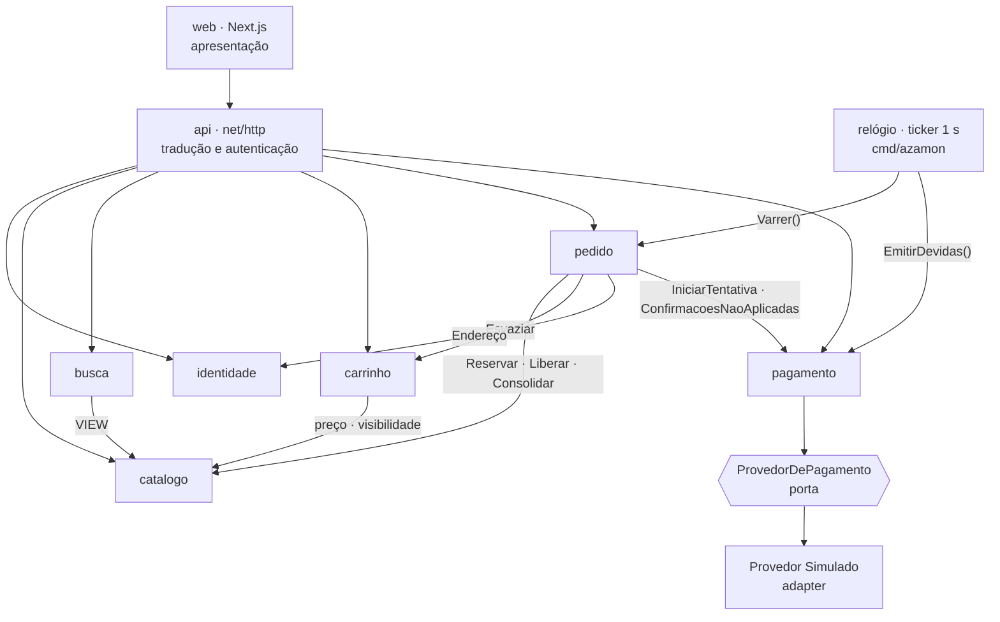
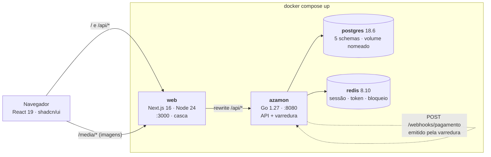
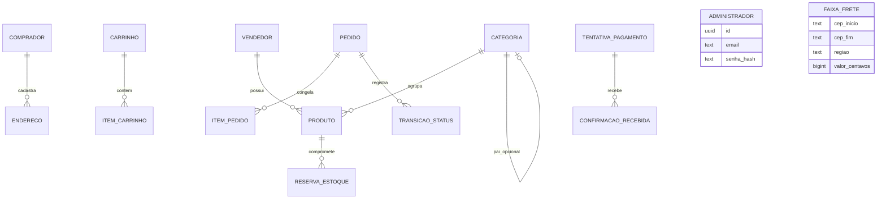

# Espinha de Arquitetura — Azamon

## Paradigma de Design

**Monólito modular.** Um binário Go, seis pacotes de domínio, e uma regra: um módulo só é alcançado pela sua interface pública. Os seis são a lista canônica do NFR-2 e não se negocia um sétimo.

**Portas-e-adaptadores só onde a costura é real.** A porta existe onde o §11 do PRD promete uma troca futura — pagamento, busca, armazenamento de imagem. Em todo o resto, chamada de função direta. Interface com uma implementação e sem troca prevista é cerimônia, não arquitetura.

| Camada | Onde vive | O que pode |
|---|---|---|
| Apresentação | `web/` (Next.js) | Renderizar e chamar `/api`. Nenhuma regra. |
| Tradução | `api/` | Rota, autenticação, DTO, validação de limite, erro→HTTP. Nenhuma regra de domínio. |
| Domínio | `internal/<módulo>/` | Toda a regra. Um arquivo público por módulo. |
| Plataforma | `internal/plataforma/` | Configuração, log, correlação, transação, tradução de erro. |

## Invariantes e Regras

### AD-1 — Os seis módulos e a direção da dependência

- **Binds:** todo o código Go
- **Prevents:** o grafo de dependência virar bidirecional e o §11 (extrair um serviço) exigir reescrita em vez de mudança
- **Rule:** um módulo importa outro **apenas** por `internal/<módulo>/<módulo>.go`. As setas abaixo são exaustivas e rotuladas com o que atravessa: uma seta que não está aqui é defeito, e uma seta invertida é ciclo. **A regra tem mecanismo:** `internal/fronteira_test.go` lê o grafo de importação com `go list -deps -json` e falha se aparecer aresta fora desta tabela — o AD-2 tem o seu par, uma consulta a `information_schema` que falha se existir FK cruzando schema.



`identidade` e `catalogo` não dependem de ninguém. **`pagamento` não conhece `pedido`** (AD-7), e **`carrinho` não conhece `identidade`** — a posse vem do `comprador_id` da Sessão, que `api/` injeta (AD-11). O relógio não é módulo e não decide nada: só chama, na ordem do AD-6.

Este grafo, com estes rótulos, **é** o diagrama dos seis módulos que o §6.1 do PRD põe no escopo e a SM-7 mede.

### AD-2 — A fronteira do módulo é um schema do Postgres

- **Binds:** todo o esquema de banco
- **Prevents:** o `JOIN` de três tabelas e dois módulos escrito sob pressa, que apaga a fronteira do NFR-2 sem ninguém decidir isso
- **Rule:** um schema por módulo — `identidade`, `catalogo`, `carrinho`, `pedido`, `pagamento`. Uma consulta lê **apenas** o próprio schema. **Chave estrangeira cruzando schema é proibida.** `busca` não tem tabelas: lê `catalogo` por uma VIEW dedicada, que é a costura do Elasticsearch. Referência cruzada carrega `uuid` sem FK, e o lado que referencia congela o que precisa exibir (tabela de travessias na Semente Estrutural).

### AD-3 — A transição é o único ponto de mutação do Pedido, e cada transição carrega seu efeito

- **Binds:** FR-23, FR-26..FR-34, `internal/pedido`
- **Prevents:** o bug mais caro do sistema — um Pedido cancelado que não devolve ao Estoque, ou uma Reserva que sobrevive ao Pedido; e dois caminhos de escrita divergirem, um registrando histórico e outro não
- **Rule:** conteúdo do Pedido (Itens de Pedido, preço praticado, Endereço, Frete, total) é escrito uma vez, na criação, e nunca mais. Só o Status do Pedido muda, e só por `pedido.Transicionar(ctx, tx, pedidoID, esperado, novo, ator, motivo)`. Não existe `UPDATE pedido SET status`. Toda transição escreve em `pedido.transicao_status`, com `motivo` — é onde `TEMPO_ESGOTADO` (FR-34) e o motivo da recusa (FR-27) moram. **A tabela abaixo é exaustiva e obrigatória**: nenhuma transição fora dela existe, e nenhuma acontece sem o efeito da terceira coluna, na mesma transação (AD-4).

| Transição | Provocada por | Efeito obrigatório sobre Estoque e Carrinho |
|---|---|---|
| criação → `AGUARDANDO_PAGAMENTO` | Checkout do Comprador (FR-23) | `catalogo.Reservar` — tudo ou nada sobre todos os itens (FR-24) — **e depois** `carrinho.Esvaziar`, na mesma transação |
| `AGUARDANDO_PAGAMENTO` → `PAGO` | Confirmação (FR-26) | nenhum — a Reserva permanece |
| `AGUARDANDO_PAGAMENTO` → `PAGAMENTO_RECUSADO` | Confirmação de recusa (FR-27) | `catalogo.Liberar` |
| `AGUARDANDO_PAGAMENTO` → `PAGAMENTO_RECUSADO` | Expiração (FR-34), `motivo=TEMPO_ESGOTADO` | `catalogo.Liberar` |
| `PAGAMENTO_RECUSADO` → `AGUARDANDO_PAGAMENTO` | Nova Tentativa (FR-27) | `catalogo.Reservar` de novo; **falha se indisponível** |
| `PAGO` → `SEPARANDO` | Administrador (FR-32) ou simulação (FR-33) | nenhum |
| `SEPARANDO` → `ENVIADO` | Administrador (FR-32) ou simulação (FR-33) | `catalogo.Consolidar` — baixa o total, encerra a Reserva |
| `ENVIADO` → `ENTREGUE` | Administrador (FR-32) ou simulação (FR-33) | nenhum |
| {`AGUARDANDO_PAGAMENTO`, `PAGAMENTO_RECUSADO`, `PAGO`, `SEPARANDO`} → `CANCELADO` | Comprador (FR-31) | `catalogo.Liberar`, se ativa |

**O Carrinho é esvaziado pela criação do Pedido, e por mais ninguém.** `pedido.Criar` chama `carrinho.Esvaziar(ctx, tx, compradorID, itemIDs)` na mesma transação, depois de `catalogo.Reservar` suceder — os itens passam a viver no próprio Pedido. É o único ponto em que outro módulo escreve no Carrinho, e não existe `DELETE /api/v1/carrinho` para esse fim. Cancelar um Pedido **não** devolve nada ao Carrinho.

**`Transicionar` é um compare-and-swap, e a ordem é normativa.** É literalmente `UPDATE pedido SET status = $novo WHERE id = $1 AND status = $esperado` — **zero linhas afetadas é `ErrEstadoJaAvancado`**, e é assim que a corrida entre Administrador e simulação se resolve sem bloqueio explícito. A ordem dentro da transação é fixa: **transição primeiro, efeito sobre o Estoque depois** — o efeito só roda para quem ganhou o CAS, então ninguém libera uma Reserva duas vezes.

**Três recusas distintas, nunca uma só.** A `EXPERIENCE.md` dá a cada uma um comportamento de tela diferente, então fundi-las apaga o clímax da UJ-3 e da UJ-4:

| Erro | Quando | Como a tela trata |
|---|---|---|
| `pedido.ErrEstadoJaAvancado` | o `esperado` não bate porque **outro ator** avançou (Administrador × simulação) | informativo — recarrega e mostra o estado real |
| `pedido.ErrTransicaoInvalida` | a transição não está na tabela acima | destrutivo — é defeito de quem chamou. Carrega em `dados.permitidas` as transições legais a partir do estado atual, que é o que a FR-32 usa para montar os botões do Administrador |
| `pedido.ErrForaDaJanelaDeCancelamento` | cancelar um Pedido que já saiu da janela (`ENVIADO`, `ENTREGUE` ou já `CANCELADO`) | explica por que não dá mais. **O cancelamento reclassifica:** um `ErrEstadoJaAvancado` cuja causa foi sair da janela é devolvido como este, nunca como corrida |

### AD-4 — Uma transação por caso de uso, atravessando a fronteira como parâmetro

- **Binds:** todo caso de uso que muta mais de um módulo
- **Prevents:** o efeito sobre o Estoque e a transição de Status caírem em transações diferentes e divergirem
- **Rule:** quem inicia o caso de uso abre a transação e a passa adiante **explicitamente**, como parâmetro nomeado: `Reservar(ctx context.Context, tx pgx.Tx, …)`. Transação em `context.Context` é proibida — invisível é esquecível. Nenhum módulo abre transação própria quando recebe uma. **Nenhuma chamada de rede acontece dentro de uma transação aberta** — o webhook do AD-8 é emitido pelo relógio, depois do commit.

  **Nível de isolamento: `READ COMMITTED`**, o padrão do Postgres — declarado, não presumido, porque a corretude do AD-5 depende de bloqueio explícito e não de isolamento. **A ordem de aquisição de bloqueio é global e única:** primeiro a linha de `pedido`, depois as linhas de `catalogo.produto` **ordenadas por `id`**. Sem essa ordem, dois Pedidos com os mesmos dois Produtos em ordem inversa produzem *deadlock*. `api/` repete uma vez, e só uma, uma transação que morra com `40P01` (deadlock) ou `40001` (serialização).

### AD-5 — O Catálogo é dono do Estoque; disponível é derivado

- **Binds:** FR-11, FR-24, FR-28, FR-31, NFR-7
- **Prevents:** um contador mutável de disponibilidade espalhado — e a variante em que `pedido` e `catalogo` guardam versões diferentes da mesma verdade
- **Rule:** `catalogo` é dono de `produto.estoque_total` e de `catalogo.reserva_estoque`. `pedido` nunca toca tabela de Estoque; usa `catalogo.Disponivel(ctx, produtoIDs []uuid) map[uuid]int`, `Reservar`, `Liberar`, `Consolidar` — **`Disponivel` é em lote**, porque toda tela que precisa dele precisa para vários Produtos. **Estoque disponível nunca é armazenado:** é `estoque_total − Σ reservas ativas`, calculado na consulta, e é o único número que sai para qualquer tela ou VIEW.

  **A linha de `produto` é o mutex de uma grandeza que mora em `reserva_estoque`, então a ordem é obrigatória e são dois comandos:** `SELECT … FROM produto WHERE id = ANY($1) ORDER BY id FOR UPDATE` **primeiro**, e só depois a soma das reservas ativas. Ler a soma antes de segurar o bloqueio é o defeito que vende a mesma última unidade duas vezes — e é exatamente o que o teste do NFR-7 dispara. A FR-11 (Administrador não baixa o total abaixo das reservas) segue a mesma ordem.

  **A Reserva de Estoque tem estado, não só existência:** `ATIVA → LIBERADA | CONSOLIDADA`, com **índice único parcial sobre `(pedido_id, produto_id) WHERE estado = 'ATIVA'`** — liberar ou consolidar duas vezes vira impossível, não improvável. `Liberar` e `Consolidar` mudam o estado da Reserva; **`Liberar` nunca escreve `estoque_total`**, só `Consolidar` escreve.

  **Toda função de mutação de Estoque é idempotente e declara isso na assinatura.** `Liberar` sem reserva ativa devolve `nil`; `Consolidar` sobre reserva já consolidada é no-op; `Reservar` com lista vazia é no-op. O "se ativa" da tabela do AD-3 descreve o efeito observável, **nunca uma checagem que `pedido` deva fazer antes de chamar** — `pedido` chama `Liberar` incondicionalmente em toda transição para `CANCELADO` e em toda recusa. Silêncio sobre o caso "já feito" é o defeito: leva um módulo a devolver erro onde o outro espera sucesso, e o cancelamento de um Pedido em `PAGAMENTO_RECUSADO` falha sempre, com rollback.

  **`Disponivel` é conselho, nunca decisão.** Ele serve tela e revalidação; quem decide é o `Reservar` sob bloqueio. A divergência entre o número exibido e o aceito é projetada, e a `EXPERIENCE.md` já a trata como o caminho de recusa.

  `ponytail:` bloqueio pessimista por linha basta nesta escala; se a demonstração revelar contenção, o caminho é reserva otimista com repetição, não fila de pedidos.

### AD-6 — A varredura é o único motor do tempo

- **Binds:** FR-25, FR-26, FR-27, FR-33, FR-34
- **Prevents:** um Pedido congelado porque o contêiner reiniciou e o temporizador que o avançaria morreu na memória
- **Rule:** nenhum estado é alcançado por `time.Timer`, `time.After`, `time.AfterFunc` ou agendamento em memória — **em nenhum módulo, inclusive no Provedor Simulado.** Um *goroutine* em `cmd/azamon` tica a cada 1 s e **não decide nada**: ele só chama, nesta ordem normativa, dois passos que pertencem aos seus donos.

  | Ordem | Chamada | Dono | Requisito |
  |---|---|---|---|
  | 1 | `pedido.Varrer` — **aplica** as confirmações não aplicadas | `pedido` | FR-26, FR-27 |
  | 2 | idem — **expira** a Tentativa cujo prazo venceu | `pedido` | FR-34 |
  | 3 | idem — **avança** a etapa devida da simulação de entrega | `pedido` | FR-33 |
  | 4 | `pagamento.EmitirConfirmacoesDevidas` — **emite** o POST do AD-7 | `pagamento` | FR-25 |

  **Emitir é comportamento do Provedor, então mora em `pagamento`** — pô-lo em `pedido` colocaria conhecimento de gateway dentro do Pedido e quebraria o NFR-3 e a SM-5 na primeira troca. Aplicar vem antes de expirar: senão uma aprovação que chegou no prazo é descartada por um relógio que rodou primeiro.

  **Uma transação por Pedido, nunca uma por tique** — um Pedido que falhe não pode derrubar a varredura dos outros. Toda leitura usa `FOR UPDATE SKIP LOCKED`. `ErrEstadoJaAvancado` é desfecho **esperado** da varredura, registrado e seguido em frente, nunca erro. Um relógio, quatro requisitos.

### AD-7 — Idempotência estrutural: webhook e inbox

- **Binds:** FR-25, FR-26, NFR-3, NFR-12, SM-5
- **Prevents:** que a fronteira de pagamento seja promessa em vez de fato — e que `pagamento` e `pedido` formem ciclo
- **Rule:** a confirmação entra por `POST /api/v1/webhooks/pagamento`, o mesmo caminho que o Stripe usaria. `pagamento` grava em `pagamento.confirmacao_recebida` com **restrição única sobre a chave de idempotência** — receber duas vezes é um `INSERT` que falha, não código defensivo. `pagamento` **não chama `pedido`**: a varredura de `pedido` lê por `pagamento.ConfirmacoesNaoAplicadas` e aplica. Cada confirmação tem estado terminal, senão a varredura nunca para:

  `PENDENTE` → `APLICADA` · ou → `NAO_APLICAVEL_SINALIZADA` — registrada, sinalizada ao Administrador, **nunca aplicada**.

  **Uma confirmação só é aplicada se pertence à Tentativa de Pagamento corrente do Pedido _e_ o Pedido está em `AGUARDANDO_PAGAMENTO`.** Todo outro caso — Pedido já `CANCELADO` (FR-26), ou confirmação de uma Tentativa anterior chegando depois da nova (FR-27) — é terminal e sinalizado. Sem isso, uma recusa atrasada da Tentativa 1 derruba a Reserva que a Tentativa 2 acabou de criar.

  **A emissão é derivada, não marcada** (AD-6, passo 4): "Tentativa cujo atraso venceu **e** que não tem linha na inbox". A chave de idempotência é determinística por Tentativa, então reemitir depois de uma queda entre o commit e o POST é inofensivo — e é o que impede tanto a confirmação perdida quanto o reenvio eterno.

  **Criar Pedido guarda chave _e_ digest do corpo.** Mesma chave com mesmo corpo devolve **o Pedido original**, não erro — reenviar é a coisa certa a fazer, e a UX manda o botão continuar na tela durante a operação. Mesma chave com corpo diferente é `409`. O `23505` do banco é sinal para o código decidir, **nunca** resposta para o navegador.

### AD-8 — O Provedor de Pagamento é porta; o Simulado é adapter determinístico

- **Binds:** FR-25, NFR-3, SM-5
- **Prevents:** que trocar pelo Stripe toque no checkout, no Pedido ou na máquina de estados
- **Rule:** a porta tem duas operações e mais nada: `IniciarTentativa(ctx, tx, pedidoID, totalCentavos) (idExterno, error)` e a confirmação que chega por webhook. O total vai como valor — o adapter **não** consulta `pedido`. O Provedor Simulado decide pelos centavos do total conforme §7.1 do PRD, apenas na primeira Tentativa de Pagamento; da segunda em diante aprova. As faixas vivem em configuração porque o NFR-16 exige (AD-13), mas **não existe superfície de operador nem alternância em tempo de execução**: nada é reconfigurado entre roteiros, e o apresentador provoca o desfecho escolhendo Produto e quantidade. **O teto de 3 Tentativas de Pagamento por Pedido (§7.1, FR-27) é de `pagamento`**, que é dono da entidade: `IniciarTentativa` recusa com `ErrTetoDeTentativas` e o `pedido` traduz isso na recusa da transição. Nenhum dado de cartão entra em lugar nenhum, nem simulado.

### AD-9 — Dinheiro é `int64` de centavos, ponta a ponta

- **Binds:** NFR-13, FR-9, FR-21, FR-22, FR-23
- **Prevents:** o total exibido não fechar com a soma das parcelas exibidas
- **Rule:** `bigint` no banco, `int64` no Go, inteiro no JSON, sempre com sufixo `_centavos`. `float` e `numeric` em valor monetário são proibidos em qualquer camada. **`total_centavos` é coluna do Pedido com `CHECK (total_centavos = subtotal_centavos + frete_centavos)`, nunca derivação.** Nenhum caminho de leitura recompõe o total — se recompusesse, o total que a tela mostra poderia divergir do total que o Provedor Simulado usou para decidir pelos centavos, e o desfecho da apresentação viraria loteria. **Nenhuma divisão existe no caminho monetário:** o Frete não é rateado por item, não há desconto proporcional, não há imposto. Formatação para `R$` acontece só no navegador, com `Intl.NumberFormat('pt-BR')`.

### AD-10 — O Next.js é casca; nenhuma regra mora no Node

- **Binds:** `web/`, NFR-2, NFR-6
- **Prevents:** regra de negócio vazar dos seis módulos para um sétimo lugar que ninguém chamou de módulo
- **Rule:** `next.config.js` reescreve `/api/*` para o Go — o navegador conhece **uma origem só**, então não há CORS nem `SameSite=None`. Proibidos: Server Actions, Route Handlers com regra, acesso a banco ou Redis do Node, e `fetch` do servidor Next para o Go dentro de RSC. Um caminho de dado: navegador → `/api` → Go. O processo Node não guarda estado de domínio nenhum. Duas armadilhas do Next.js 16 que falham **em silêncio**: `middleware.ts` foi renomeado para `proxy.ts` e um arquivo com o nome antigo é ignorado sem erro de build; e a otimização de `next/image` recusa upstream que resolva para IP privado — que é o `azamon` do compose. As imagens do Catálogo Semeado usam `unoptimized`, coerente com o AD-12, que já quer o Go como dono do byte.

### AD-11 — Autorização no servidor, por dono do recurso

- **Binds:** FR-4, NFR-6, todo recurso de Comprador
- **Prevents:** a checagem existir na rota que alguém lembrou e faltar na que ninguém lembrou
- **Rule:** `api/` resolve a Sessão e injeta a identidade; **a verificação de posse acontece dentro do módulo dono do recurso, na mesma consulta que carrega o dado** (`WHERE id = $1 AND comprador_id = $2`), nunca como `if` depois da leitura. Recurso de outro Comprador devolve o mesmo erro de inexistente. O papel de Administrador é verificado em `api/`, por prefixo de rota — a área administrativa é separada da loja.

### AD-12 — Nada de rede externa em tempo de execução

- **Binds:** NFR-15, `web/`, `media/`
- **Prevents:** a demonstração quebrar em silêncio, na sala, sem Wi-Fi
- **Rule:** a fonte `Azamon Sans` é um WOFF2 auto-hospedado em `web/public/fonts/`, com a pilha de sistema como alternativa declarada. Sem Google Fonts, sem `@import url(http`, sem `//cdn.`. As imagens do Catálogo Semeado são arquivos de `media/`, servidos **pelo Go**, com URL relativa no banco — é assim que a costura do S3 fica do lado certo da fronteira. Um passo de CI faz `grep` por `fonts.googleapis`, `@import url(http`, `//cdn.` **e `next/font/google`** — o último é a forma que o próximo desenvolvedor vai escrever sem perceber — e falha o build.

### AD-13 — Todo limiar vem de configuração, e demonstração é o padrão

- **Binds:** NFR-14, NFR-16, §7.1 do PRD
- **Prevents:** encolher um prazo para a apresentação exigir tocar em código — e alguém esquecer a flag na sala
- **Rule:** os 15 parâmetros do §7.1 são o **mínimo declarado, não a lista fechada**: junta-se a eles a configuração operacional que a arquitetura criou — intervalo da varredura, atraso da confirmação simulada, simulação de entrega ligada ou desligada (FR-33), URL base do webhook. Todos são variáveis de ambiente com prefixo `AZAMON_`, lidas **uma vez** para uma struct no arranque. Constante de limiar espalhada pelo código é defeito. **`api/` é a camada que aplica os limites do NFR-14**, na decodificação do DTO, lendo da mesma struct — nunca no domínio, nunca no navegador só. O `.env` versionado traz os valores de demonstração; os de produção ficam declarados como padrão no código. `docker compose up` sem argumento sobe em modo demonstração.

### AD-14 — Erro nomeado no módulo, traduzido num único ponto

- **Binds:** todos os módulos, `api/`
- **Prevents:** "transição inválida falha alto" virar sete comportamentos, um por handler — e a tela não ter como dizer *quanto* faltou
- **Rule:** cada módulo exporta erros sentinela (`pedido.ErrTransicaoInvalida`, `catalogo.ErrEstoqueInsuficiente`). Módulo **não** conhece código HTTP. `internal/plataforma/erro` faz o mapeamento, num arquivo só. O envelope carrega dado, não só texto, porque a `EXPERIENCE.md` precisa dele:

```json
{ "erro": { "codigo": "ESTOQUE_INSUFICIENTE",
            "mensagem": "Restam 2 unidades de Carregador USB-C.",
            "dados": { "produto_id": "…", "disponivel": 2, "solicitado": 5 },
            "correlacao": "…" } }
```

  `codigo` em `SCREAMING_SNAKE`, estável, usável em teste. `mensagem` em português, seguindo a *Voice and Tone*. Erro engolido é proibido: ou é tratado, ou sobe.

### AD-15 — Rastreabilidade: correlação na requisição, número e histórico no Pedido

- **Binds:** NFR-9, FR-29, FR-30, §8 do PRD
- **Prevents:** "dado um número de Pedido, reconstruir a sequência de eventos" ser possível só para quem escreveu o código
- **Rule:** middleware gera ou aceita `X-Correlation-Id`, coloca no `context`, em toda linha de log (`log/slog`, JSON) e **no cabeçalho da resposta** — a `EXPERIENCE.md` exige que o `Toast` de erro do servidor a exiba. O Pedido tem **`numero`**, curto, legível e estável, separado do `uuid` da chave primária: quatro superfícies o exibem e o NFR-9 parte dele. `pedido.transicao_status` guarda estado anterior, novo, ator, motivo, instante e correlação — é a mesma tabela que a linha do tempo da FR-30 renderiza e que a varredura do AD-6 lê. Uma fonte, três usos. **Nenhum dado pessoal entra em log** (§8, Privacidade): e-mail, Endereço e nome saem como identificador, nunca como valor.

### AD-16 — A busca é atrás da própria interface

- **Binds:** FR-12..FR-15, NFR-4, §11 do PRD
- **Prevents:** consultas de busca espalhadas por controladores, transformando a troca pelo Elasticsearch numa caça ao `SELECT`
- **Rule:** **`GET /api/v1/produtos` é servido exclusivamente por `busca`, com ou sem `termo`** — "listar sem termo" é "buscar com termo vazio", nunca uma rota separada; a Vitrine é uma listagem. `catalogo` **não registra handler de listagem nem de paginação de Produto**; expõe `ObterVisivel(id)` para a página de Produto e `Visiveis`/`Disponivel` por chamada Go. Duas equipes registrando o mesmo padrão no `ServeMux` fazem o binário entrar em pânico no arranque, então a posse é exaustiva como a do AD-1:

  | Rota | Dono |
  |---|---|
  | `GET /api/v1/produtos` (com ou sem `termo`, filtros, ordenação, paginação) | `busca` |
  | `GET /api/v1/produtos/<id>` | `catalogo` |
  | `/api/v1/admin/produtos…` (CRUD, Estoque) | `catalogo` |

  Rota de Produto sem linha nesta tabela é defeito. Nenhum módulo além de `busca` monta consulta para localizar Produto. `busca` lê `catalogo` por VIEW, nunca por tabela, e **a VIEW expõe `estoque_disponivel` derivado (AD-5), nunca `estoque_total`** — senão a Vitrine promete unidade que o Carrinho recusa. Normalização (sem acento, minúscula) acontece **na escrita**, em coluna dedicada preenchida pelo Go, com índice GIN `pg_trgm` — não em `tsvector` com pontuação, porque o §5 do PRD proíbe relevância por pontuação e a FR-14 já fixa três ordenações com desempate estável. `CREATE EXTENSION IF NOT EXISTS pg_trgm` é a primeira migração de `catalogo` — a imagem oficial do Postgres traz a extensão, mas não habilitada.

### AD-17 — A Regra de Frete é dado, e mora no Pedido

- **Binds:** FR-19, FR-20, FR-21, FR-22, FR-23
- **Prevents:** o `if` de Frete espalhado pelo checkout, e a variante em que o Carrinho calcula um Frete que a Revisão contradiz
- **Rule:** a Regra de Frete é a tabela `pedido.faixa_frete` (faixa de CEP → região → valor em centavos) mais uma função pura em `internal/pedido`, e o limiar de isenção vem da configuração (AD-13). CEP fora de qualquer faixa cai na região padrão (FR-21). **`carrinho` não calcula Frete** — a `EXPERIENCE.md` fixa a composição do Carrinho como subtotal e nada mais; a distância até a isenção usa só o limiar. O Frete é congelado no Pedido na criação, e o recálculo da FR-19 acontece na entrada do checkout, que é `pedido`. **`carrinho.Itens` é leitura pura e nunca escreve `preco_visto_centavos`.** Uma função só o atualiza — `carrinho.ConfirmarPrecoVisto` — e só `pedido` a chama, na transação de entrada no checkout, **depois** de já ter reportado a diferença. A tela do Carrinho mostra o preço atual ao lado do visto sem gravar nada; quem persiste a ciência da mudança é sempre o checkout, uma vez, quando o Comprador de fato avança. Os dois escrevendo é a mudança de preço que some antes de aparecer.

  **A criação recalcula sob o mesmo bloqueio em que reserva, e recusa com `TOTAL_DIVERGENTE` se o total mudou desde a Revisão** — senão o Comprador confirma um valor e paga outro, e o §12 do PRD chama justamente o passo irreversível de o único ponto laranja do fluxo.

### AD-18 — A resposta carrega tudo que a tela deriva dela

- **Binds:** todo endpoint de leitura, `api/`, `web/`
- **Prevents:** a tela fazer três chamadas para decidir um botão — e o relógio de expiração voltar a ser contado no navegador, que a invariante 6 proíbe
- **Rule:** **nenhuma tela faz mais de uma chamada para derivar uma ação.** A `EXPERIENCE.md` deriva a ação disponível de uma tripla — `(Status do Pedido, tentativas restantes, disponibilidade dos Itens de Pedido)` — então a resposta do Pedido carrega as três, montadas por `pedido` a partir de `pagamento` e `catalogo`:

```json
{ "numero": "AZ-2026-000148", "status": "AGUARDANDO_PAGAMENTO",
  "expira_em": "2026-09-05T14:32:10Z",
  "tentativas_restantes": 2,
  "itens": [ { "produto_id": "…", "nome": "…", "quantidade": 1,
               "preco_praticado_centavos": 14990, "disponivel": true } ],
  "subtotal_centavos": 14990, "frete_centavos": 0, "total_centavos": 14990,
  "historico": [ { "de": null, "para": "AGUARDANDO_PAGAMENTO",
                   "ator": "COMPRADOR", "motivo": null, "em": "…" } ] }
```

  **Todo instante é absoluto e vem do servidor**, em RFC 3339 — nunca uma duração em segundos, porque duração recomeça quando a página recarrega. Consulta em intervalo existe em exatamente três superfícies e em nenhuma outra: `GET /pedidos/<id>` a cada 3 s enquanto `AGUARDANDO_PAGAMENTO`; o mesmo a cada 10 s enquanto o estado não for terminal; `GET /admin/pedidos` a cada 10 s enquanto listar Pedido não terminal. **Terminal significa `ENTREGUE` ou `CANCELADO`**, e mais nada — é a única leitura consistente com a tabela do AD-3, onde nenhum dos dois aparece como origem. Existe **uma função só**, `pedido.EstadoTerminal(s Status) bool`, usada pelas três superfícies de consulta sem exceção. Nenhuma segunda noção de terminal é declarada: quem precisa de um corte mais estreito testa o `Status` contra os valores nomeados.

  **Toda listagem usa um envelope só**, porque quatro superfícies de três módulos precisam do mesmo: `{ "itens": [...], "pagina": 1, "por_pagina": 20, "total": 137 }`. A ordenação declarada da FR-14 sempre termina em `id` ascendente como desempate — sem isso a paginação repete e some com linhas entre páginas. `por_pagina` vem do servidor, com o teto do §7.1.

  A resposta administrativa do Pedido carrega `pagamento_aprovado_sobre_cancelado`, que é como o sinal `NAO_APLICAVEL_SINALIZADA` do AD-7 chega às duas superfícies do Administrador — um estado sem caminho de leitura é um estado que ninguém vê.

  **Nenhum campo de resposta nomeia a Reserva de Estoque para o Comprador** — é conceito de domínio, e a `EXPERIENCE.md` proíbe expô-lo.

### AD-19 — Visibilidade do Produto é um predicado único do Catálogo

- **Binds:** FR-6, FR-7, FR-8, FR-9, FR-12, FR-17
- **Prevents:** a Vitrine mostrar um Produto que a busca esconde, ou o Carrinho aceitar um Produto de Vendedor desativado
- **Rule:** "Produto visível" (Produto ativo **e** Vendedor ativo) é definido uma vez, em `catalogo`, e exposto por `catalogo.Visiveis`. A VIEW do AD-16 é construída sobre o mesmo predicado. Vitrine, página de Produto, Carrinho e criação de Pedido passam todos por ele. Nenhum outro lugar escreve `WHERE ativo = true`.

  **O predicado vale também dentro das funções de escrita do AD-5, não só nas telas.** `Disponivel` devolve `0` para Produto inexistente ou invisível — nunca omite a chave do mapa, nunca devolve erro: "disponível" já embute "comprável". `Reservar` verifica visibilidade **na mesma consulta `FOR UPDATE`** em que verifica Estoque, e reservar Produto invisível falha com o mesmo `catalogo.ErrEstoqueInsuficiente` — do ponto de vista do Comprador é a mesma frase. Sem isso, comprar de Vendedor desativado é o cenário que o *Prevents* deste AD nomeia e que nenhuma Rule impedia.

### AD-20 — Credencial ao piso do OWASP; o token de redefinição não tem por onde sair

- **Binds:** FR-1, FR-2, FR-3, NFR-5, §8 do PRD
- **Prevents:** senha guardada com hash de uma passagem — e a FR-3 ser especificada sem que exista canal para entregar o token
- **Rule:** senha com **Argon2id** (`golang.org/x/crypto/argon2`), parâmetros do OWASP: `m=19456` (19 MiB), `t=2`, `p=1`; sal aleatório de 16 bytes por usuário (comprimento vindo da RFC 9106, não do OWASP, que não o fixa). Nunca bcrypt de fator baixo, nunca SHA de uma passagem. Sessão, token de redefinição e contador de bloqueio de login vivem no Redis com TTL nativo — os três são dado com prazo de validade. **Não existe serviço de e-mail** (§5 do PRD, e NFR-15 proíbe rede): o token da FR-3 é emitido para o log estruturado, e o apresentador o lê em `docker compose logs`. Emitir novo token invalida os anteriores.

  `ponytail:` token no log é o suficiente — a FR-3 é a primeira da ordem de corte do §6.3. Se ela sobreviver e alguém quiser a experiência completa, o caminho é um contêiner Mailpit, que roda offline.

## Convenções de Consistência

| Assunto | Convenção |
|---|---|
| Identificadores de domínio | **Português, literalmente os 20 termos do §3 do PRD.** `Pedido`, `ItemDePedido`, `ReservaDeEstoque`, `TentativaDePagamento`. Sinônimo é defeito, em código como em tela. Termos técnicos (`ctx`, `err`, `tx`) seguem o Go. |
| Pacotes e schemas | Mesmo nome, singular, minúsculo: `identidade`, `catalogo`, `busca`, `carrinho`, `pedido`, `pagamento`. |
| Tabelas e colunas | `snake_case`, singular: `item_pedido`, `preco_praticado_centavos`. |
| Chaves primárias | `uuid` com `DEFAULT uuidv7()` — nativo do Postgres 18, ordenado no tempo, sem extensão. O `uuid` nunca é o "número do Pedido": esse é `AZ-<ano>-<6 dígitos>`, de uma sequência do Postgres por ano (AD-15). |
| Datas | `timestamptz`, sempre UTC no banco; RFC 3339 no JSON; fuso aplicado só na renderização. |
| Dinheiro | Coluna `bigint`, sufixo `_centavos`, JSON inteiro. Nunca `numeric`, nunca `float`. |
| Rotas | `/api/v1/<recurso-plural-em-português>` — `/api/v1/produtos`, `/api/v1/pedidos`. Área administrativa sob `/api/v1/admin/`. |
| Estado de listagem | Vive na URL como parâmetro de consulta, no back-end e no front-end (`?termo=&categoria=&pagina=`). Voltar no navegador funciona; o link reproduz a tela. |
| Envelope de erro | `{"erro":{"codigo","mensagem","dados","correlacao"}}` — ver AD-14. |
| Idempotência | `Idempotency-Key` gerado **pelo navegador** ao entrar na Revisão e guardado em `sessionStorage`, para sobreviver ao recarregamento que ele existe para proteger; enviado em `POST /pedidos`. No webhook, chave determinística por Tentativa (AD-7). Restrição única no banco é o mecanismo. |
| Sessão | Cookie `azamon_sessao`, `HttpOnly`, `SameSite=Lax`, opaco de 256 bits. O valor é chave no Redis com TTL; nada de conteúdo no cookie. |
| Configuração | Variável de ambiente, prefixo `AZAMON_`, lida uma vez no arranque. Segredo nunca no repositório. |
| Migrações | `db/migracoes/<timestamp>_<módulo>_<descrição>.sql`, formato goose com **versionamento por timestamp** (`goose create`) — sequencial `NNNN` colide quando duas pessoas criam migração no mesmo dia. Embutidas por `embed.FS` e aplicadas no arranque do binário, antes da semente. Nunca auto-migração. |
| Catálogo Semeado | Vive em `db/semente/`, versionado, com semente fixa de aleatoriedade. O binário o aplica no arranque, **depois** das migrações e só se o marcador de versão da semente não existir — subir duas vezes produz exatamente os mesmos Vendedores, Categorias e Produtos. **A semente não cria Pedido**, então nada nela consome `numero`. Nomes, descrições, preços e imagens plausíveis (NFR-1), mais uma conta de Administrador e uma de Comprador. Conjunto de 5.000 Produtos disponível para a medição do NFR-4. O Postgres usa volume nomeado; `docker compose down -v` é o botão de reinício. |
| Testes | Máquina de estados em memória; testcontainers-go onde a transação é o objeto do teste. **Todo FR do fluxo busca → Carrinho → checkout → Pedido tem ao menos um teste que falha se a consequência declarada quebrar** (NFR-8). |
| Log | `log/slog` em JSON, com `correlacao` e `modulo` em toda linha. Sem dado pessoal (AD-15). |
| Componentes de tela | shadcn/ui em `web/components/ui/`, tokens vindos do `DESIGN.md`. Verde só para Estoque disponível e `ENTREGUE`; laranja uma vez por fluxo, no passo irreversível. |
| Commits | Conventional commits em inglês. Tudo que sai para o usuário, em português. |

## Stack

*Verificado na web em 2026-09-06.* A linha **16.3.x** do Next.js não é preferência: o patch das duas RCE críticas de 25/08/2026 pousou em 16.3.3, e a 16.2.x não recebe backport.

| Nome | Versão |
|---|---|
| Go | 1.27.1 |
| PostgreSQL | 18.6 |
| Redis | 8.10.1 |
| Node.js | 24.20.0 (LTS ativa) |
| Next.js | 16.3.4 |
| React | 19.2.8 |
| shadcn/ui | CLI, componentes copiados para o repositório |
| pgx | v5.10.0 |
| sqlc | v1.31.1 |
| goose | v3.28.0 |
| testcontainers-go | v0.44.0 |
| `golang.org/x/crypto/argon2` | Argon2id, `m=19456` `t=2` `p=1` |
| Roteamento HTTP | `net/http.ServeMux` da biblioteca padrão |

## Semente Estrutural

### Contêineres e topologia



O laço tracejado é deliberado: o Provedor Simulado confirma pelo mesmo caminho que o Stripe confirmaria (AD-7), e quem o dispara é a varredura, depois do commit (AD-4, AD-6).

### Ambientes

| Ambiente | O que é | Como sobe |
|---|---|---|
| Local / demonstração | Os quatro serviços acima, modo demonstração por padrão, Catálogo Semeado determinístico | `docker compose up` |
| Teste | Postgres efêmero por testcontainers-go, mais os testes puros em memória | `go test ./...` |

Não existe produção. O §5 do PRD declara que nada é publicado e o §8 fixa custo zero de infraestrutura; um terceiro ambiente seria arquitetura de mentira.

### Entidades e schemas



**Só aparecem aqui as relações com chave estrangeira, e portanto só as internas a um schema** — desenhar as travessias com a mesma notação diria que existe FK onde o AD-2 a proíbe; elas estão na tabela abaixo. Quem mora onde: `identidade` — Comprador, Administrador, Endereço · `catalogo` — Vendedor, Categoria, Produto, Reserva de Estoque · `carrinho` — Carrinho, Item de Carrinho · `pedido` — Pedido, Item de Pedido, Transição de Status, Faixa de Frete · `pagamento` — Tentativa de Pagamento, Confirmação Recebida.

`Comprador` e `Administrador` são tabelas separadas em `identidade` — o glossário os define como papéis distintos, o Administrador não compra, e a área administrativa já é separada da loja (AD-11). Sem coluna de papel, não há linha de Comprador que vire Administrador por engano.

As arestas que cruzam schema **não têm chave estrangeira** (AD-2). Cada uma carrega `uuid` e congela o que precisa exibir:

| Referência cruzada | Schema origem → destino | O que o lado de origem congela |
|---|---|---|
| `item_carrinho.produto_id` | `carrinho` → `catalogo` | `preco_visto_centavos` — o preço no momento da última alteração, para a FR-19 dizer "de X para Y" |
| `item_pedido.produto_id` | `pedido` → `catalogo` | Nome, `preco_praticado_centavos` e **Vendedor**, na criação (blindagem do addendum §6) |
| `reserva_estoque.pedido_id` | `catalogo` → `pedido` | Nada — a Reserva só precisa saber a quem responder |
| `pedido.endereco_id` | `pedido` → `identidade` | Endereço completo, na criação (o Pedido é imutável) |
| `tentativa_pagamento.pedido_id` | `pagamento` → `pedido` | `total_centavos`, na criação da Tentativa (o adapter não consulta `pedido`) |
| `carrinho.comprador_id`, `pedido.comprador_id` | → `identidade` | Nada |

`item_pedido` e `pedido` congelarem o que exibem é o que faz o Detalhe do Pedido (FR-30) se ler sem tocar em nenhum outro schema.

### Árvore de origem

```text
azamon/
  cmd/azamon/                 # binário único: servidor HTTP + varredura
  internal/
    identidade/               # Comprador, Administrador, Sessão, Endereço, Argon2id
    catalogo/                 # Vendedor, Categoria, Produto, Estoque, Reserva de Estoque
    busca/                    # única consulta de Produto — a costura do Elasticsearch
    carrinho/                 # Carrinho, Item de Carrinho
    pedido/                   # Pedido, Item de Pedido, máquina de estados, Frete, varredura
    pagamento/                # porta, Provedor Simulado, inbox de confirmação
    plataforma/               # config, log, correlação, erro→HTTP, transação
  api/                        # rotas, middleware, DTO, limites do NFR-14 — só tradução
  db/
    migracoes/                # goose, embutido por embed.FS
    semente/                  # Catálogo Semeado determinístico e versionado
  media/                      # imagens do Catálogo Semeado (NFR-15)
  web/                        # Next.js: app/, components/ui (shadcn), public/fonts
  docker-compose.yml
  .env                        # parâmetros do §7.1 + operacionais, em modo demonstração
```

Dentro de cada módulo, uma forma só:

```text
internal/catalogo/
  catalogo.go                 # interface pública — o ÚNICO arquivo que outro módulo importa
  servico.go                  # a regra
  dominio.go                  # tipos e invariantes
  db/consultas.sql            # fonte do sqlc
  db/gerado/                  # saída do sqlc — não editar
```

## Mapa Funcionalidade → Arquitetura

| Funcionalidade do PRD | Vive em | Governada por |
|---|---|---|
| §4.1 Conta e Identidade (FR-1..FR-5) | `internal/identidade` + Redis | AD-11, AD-13, AD-20 |
| §4.2 Catálogo (FR-6..FR-11) | `internal/catalogo` | AD-2, AD-5, AD-9, AD-12, AD-19 |
| §4.3 Busca e Navegação (FR-12..FR-15) | `internal/busca` (VIEW sobre `catalogo`) | AD-16, AD-2, AD-19 |
| §4.4 Carrinho (FR-16..FR-19) | `internal/carrinho` | AD-5, AD-9, AD-11, AD-17, AD-19 |
| §4.5 Checkout (FR-20..FR-27, FR-34) | `internal/pedido` + `internal/pagamento` | AD-3, AD-4, AD-5, AD-6, AD-7, AD-8, AD-9, AD-17, AD-18 |
| §4.6 Pedidos e Pós-venda (FR-28..FR-33) | `internal/pedido` + varredura | AD-3, AD-4, AD-6, AD-15, AD-18 |
| §6.1 Entregáveis de documentação | `README.md`, diagrama dos seis módulos, `addendum.md` vivo | AD-1 (o diagrama do AD-1 **é** o diagrama exigido) |

## Questões em Aberto

Nada aqui bloqueia começar a construir. Os quatro primeiros são **verificações**, não decisões: nenhuma fonte os desmentiu, nenhuma os confirmou, e cada um custa minutos contra horas se for descoberto tarde. Faça-os no passo 0 do addendum §8, junto com o esqueleto vertical.

| # | O que confirmar | Como, e em quanto tempo | Se der errado |
|---|---|---|---|
| 1 | `Set-Cookie` do Go atravessa o `rewrites()` do Next até o navegador (AD-10, AD-20) | Um `curl -i` contra o Next apontando para o Go | O cookie de Sessão vira o defeito que o passo 0 existe para achar. Saída: proxy explícito em vez de rewrite |
| 2 | sqlc v1.31.1 analisa `DEFAULT uuidv7()` do PG 18 | Uma migração e um `sqlc generate` | Gerar o `uuid` no lado Go; nada mais muda |
| 3 | shadcn/ui instala limpo em Next.js 16 + React 19 | `npx shadcn init` num projeto vazio | Nenhuma alternativa à vista — é a espinha de UX inteira. Descobrir isto tarde é caro |
| 4 | NFR-4: 500 ms no p95 com 5.000 Produtos | `EXPLAIN ANALYZE` sobre o Catálogo Semeado, que já é determinístico | Índice antes de serviço (ver Adiado) |
| 5 | **Enunciado ou rubrica do professor** — bloqueio 2 do `HANDOFF.md`, dono: Sung | Fora do controle do time | Quatro suposições do §16 do PRD mudam; rodar `bmad-prd` e depois esta espinha em modo atualização |

Acessibilidade (NFR-11) e responsividade (NFR-10) não têm AD aqui de propósito: são contrato da `EXPERIENCE.md` e do `DESIGN.md`, que os fixam com mais precisão do que uma regra de arquitetura conseguiria.

## Adiado

| O que | Por que pode esperar | Condição de revisita |
|---|---|---|
| **Elasticsearch** | A 5.000 Produtos a folga vem do **tamanho da tabela**, não do índice: nem uma varredura completa chega perto dos 500 ms do NFR-4. (O `pg_trgm` não extrai trigrama de termo com 1 ou 2 caracteres e degenera para varredura — irrelevante nesta escala, relevante se o Catálogo crescer) | O NFR-4 falhar em medição — e aí índice antes de serviço |
| **Cache no Redis** | Segunda cópia da verdade sem medição que a justifique | Idem acima, depois de esgotado o índice |
| **Stripe** | Conflita com o NFR-15 (demonstração offline). AD-7 e AD-8 mantêm a porta aberta | Fase 2, quando a demonstração deixar de ser offline |
| **S3 para imagens** | O AD-12 já guarda URL relativa; trocar é trocar a base | Fase 2 técnica |
| **Extrair um serviço (§11)** | Nenhuma extração antes dos três roteiros do §12 passarem (SM-C1) | SM-1 passar. Candidato: `pagamento`, que já confirma por HTTP |
| **Portal do Vendedor** | Fora por sequenciamento. O AD-11 já obriga verificação por dono do recurso, que é o predicado que falta | Rubrica do professor (bloqueio 2 do HANDOFF) |
| **Serviço de e-mail (Mailpit)** | A FR-3 é a primeira da ordem de corte do §6.3; o token no log resolve (AD-20) | A FR-3 sobreviver ao corte e alguém querer o fluxo completo |
| **Esquema completo de colunas** | O ERD fixa entidades e travessias; coluna é detalhe que o código passa a possuir | Nunca volta para cá — vive nas migrações |
| **Observabilidade além de log** | Métrica e traço não têm requisito e não são avaliados | Só se a rubrica pedir |
| **CI além do `grep` do AD-12 e do `go test`** | Não há publicação; não há pipeline a proteger | Se o professor exigir entrega por CI |
