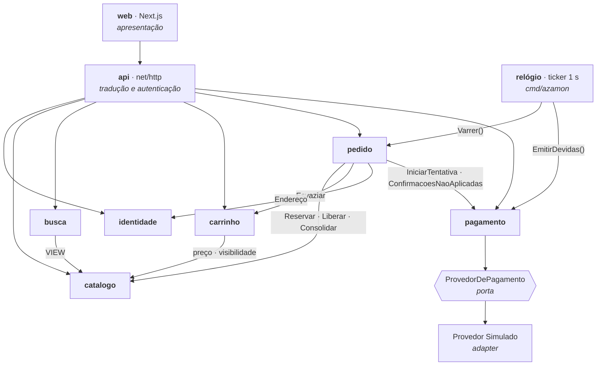

# Os seis módulos do Azamon

Entregável do §6.1 do PRD, medido pela SM-7. A decomposição é a lista canônica do NFR-2 e não se negocia um sétimo módulo. A autoridade sobre estas fronteiras é o **AD-1** da espinha de arquitetura; este documento existe para ser lido sozinho.

## O grafo

**As setas são exaustivas.** Uma seta que não está aqui é defeito; uma seta invertida é ciclo. `identidade` e `catalogo` não dependem de ninguém. `pagamento` não conhece `pedido` — a confirmação volta pelo *inbox*, não por chamada.

## O que atravessa cada fronteira

| De → Para | O que atravessa | Forma | Por que existe |
|---|---|---|---|
| `web` → `api` | JSON sobre HTTP, uma origem só | rede, via `rewrites()` | O Node é casca: não guarda estado de domínio nenhum (AD-10) |
| `api` → qualquer módulo | DTO validado + identidade da Sessão | chamada Go | `api` traduz e autentica; a posse do recurso é verificada dentro do módulo dono (AD-11) |
| `pedido` → `catalogo` | `Reservar` · `Liberar` · `Consolidar` · `Disponivel` | chamada Go, **com a transação como parâmetro** | O Estoque é do Catálogo. O efeito e a transição de Status caem na mesma transação (AD-4, AD-5) |
| `pedido` → `carrinho` | `Esvaziar` | chamada Go, mesma transação | Único ponto em que outro módulo escreve no Carrinho, e só na criação do Pedido (AD-3) |
| `pedido` → `identidade` | Endereço, congelado na criação | chamada Go | O Pedido é imutável: guarda o Endereço, não a referência viva (AD-3) |
| `pedido` → `pagamento` | `IniciarTentativa(total)` · `ConfirmacoesNaoAplicadas` | chamada Go | O total vai como **valor** — o adapter nunca consulta `pedido`, e é isso que impede o ciclo (AD-7, AD-8) |
| `carrinho` → `catalogo` | preço atual e visibilidade | chamada Go | O Carrinho não congela preço; a revalidação da FR-19 confronta o que mudou (AD-19) |
| `busca` → `catalogo` | uma VIEW dedicada, com `estoque_disponivel` | **SQL, só leitura** | É a costura do Elasticsearch: trocar o motor não toca em `catalogo` (AD-16) |
| `relógio` → `pedido`, `pagamento` | dois passos em ordem normativa | chamada Go | O relógio não decide nada; cada passo pertence ao seu dono (AD-6) |
| `pagamento` → Provedor | `ProvedorDePagamento` | **porta e adapter** | Trocar pelo Stripe altera só a implementação e a configuração (NFR-3, SM-5) |
| Provedor → `api` | `POST /api/v1/webhooks/pagamento` | **HTTP, de verdade** | O mesmo caminho que o Stripe usaria. É o que torna a SM-5 verificável em vez de declarada (AD-7) |

## A fronteira também existe no banco

Um schema do Postgres por módulo, e **chave estrangeira cruzando schema é proibida** (AD-2). A fronteira deixa de ser disciplina de código e vira objeto do banco: o `JOIN` entre dois módulos fica visível e proibível, e o marco de extrair um serviço (§11 do PRD) vira mover um schema.

| Schema | Tabelas |
|---|---|
| `identidade` | `comprador` · `administrador` · `endereco` |
| `catalogo` | `vendedor` · `categoria` · `produto` · `reserva_estoque` |
| `carrinho` | `carrinho` · `item_carrinho` |
| `pedido` | `pedido` · `item_pedido` · `transicao_status` · `faixa_frete` |
| `pagamento` | `tentativa_pagamento` · `confirmacao_recebida` |

`busca` não tem tabelas — só a VIEW. Referência que cruza schema carrega `uuid` sem FK, e o lado que referencia congela o que precisa exibir: é por isso que o Detalhe do Pedido se lê sem tocar em nenhum outro schema.

## Como a regra é verificada

Fronteira sem mecanismo é intenção. As duas têm:

- `internal/fronteira_test.go` lê o grafo de importação com `go list -deps -json` e falha se aparecer aresta fora da tabela acima.
- Uma consulta a `information_schema` falha se existir chave estrangeira cruzando schema.

## Mapa para as funcionalidades do PRD

| §4 do PRD | Módulo |
|---|---|
| 4.1 Conta e Identidade (FR-1..FR-5) | `identidade` |
| 4.2 Catálogo (FR-6..FR-11) | `catalogo` |
| 4.3 Busca e Navegação (FR-12..FR-15) | `busca` |
| 4.4 Carrinho (FR-16..FR-19) | `carrinho` |
| 4.5 Checkout (FR-20..FR-27, FR-34) | `pedido` + `pagamento` |
| 4.6 Pedidos e Pós-venda (FR-28..FR-33) | `pedido` |
