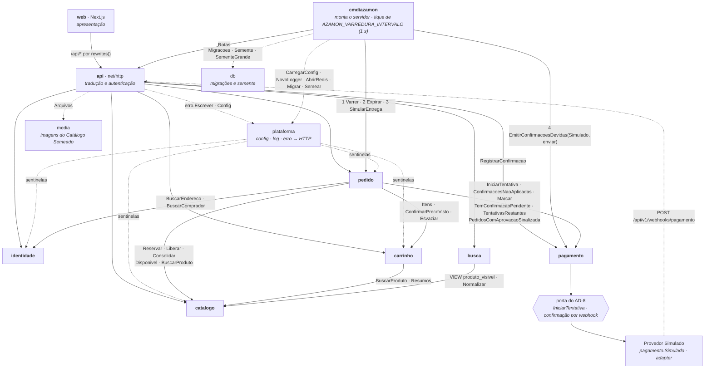

# Os seis módulos do Azamon

Entregável do §6.1 do PRD, medido pela SM-7. A decomposição é a lista canônica do NFR-2 e não se negocia um sétimo módulo. A autoridade sobre estas fronteiras é o **AD-1** da espinha de arquitetura; este documento existe para ser lido sozinho. O grafo abaixo é o mesmo bloco do AD-1, byte a byte, e foi redesenhado a partir do código em 2026-09-25 (Estória 7.2).

## O grafo

**As setas são exaustivas, e isso é conferido.** O conjunto de setas deste bloco é o conjunto da tabela `arestas` de `internal/fronteira_test.go`, nos dois sentidos: uma seta desenhada que não está na tabela, ou uma aresta da tabela que não está desenhada, derruba `TestDiagramaEhATabela`, que também exige este bloco igual ao do AD-1 na espinha. Uma seta que não está aqui é defeito; uma seta invertida é ciclo. Os rótulos nomeiam símbolos exportados que o código de fato chama, conferidos por `grep` e não pela guarda.

**Toda seta entre dois módulos de domínio tem rótulo.** A regra "rotuladas com o que atravessa" vale para elas, e todas o carregam. Duas famílias ficam sem rótulo de propósito, porque o que as atravessa está na tabela abaixo. As setas de `api` para os seis módulos carregam o DTO de cada rota. As de `pagamento → porta → simulado` carregam as duas operações do AD-8.

Três nós ficam fora da conferência: `web` não é Go, e a porta e o Provedor Simulado moram dentro de `pagamento`. O nó do relógio é `cmd/azamon`, que monta o servidor no arranque e roda o relógio depois.

**As setas pontilhadas são as de `plataforma`, `db` e `media`, mais o caminho de volta do webhook.** As de `plataforma`, `db` e `media` estão na tabela e são tão exaustivas quanto as outras, mas não são módulos do NFR-2. A de `simulado` para `api` é outra coisa: é uma chamada HTTP em tempo de execução, e não um importe, e fica fora da conferência. `cmd/azamon → api` é cheia.

`plataforma` aparece como origem por um pacote só, `internal/plataforma/erro`, que traduz os sentinelas de `identidade`, `catalogo`, `carrinho` e `pedido` num arquivo só (AD-14). A seta contrária é proibida: nenhum módulo de domínio importa `internal/plataforma/erro`, e o teste falha se algum importar. A raiz `internal/plataforma` (config, log, correlação, migração, semente) é outra coisa: fica isenta no teste, pelo pacote exato e não pela área, e qualquer pacote pode importá-la. Hoje nenhum módulo de domínio importa nem a raiz. É por isso que `cmd/azamon → plataforma` está na tabela embora o único pacote que ele importa seja a raiz isenta.

`identidade`, `catalogo` e `pagamento` não dependem de ninguém. `pagamento` não conhece `pedido`: a confirmação volta pelo *inbox*, não por chamada. `carrinho` não conhece `identidade`, porque a posse vem do `comprador_id` da Sessão, que `api/` injeta (AD-11).

## O que atravessa cada fronteira

| De → Para | O que atravessa | Forma | Por que existe |
|---|---|---|---|
| `web` → `api` | JSON sobre HTTP, uma origem só | rede, via `rewrites()` | O Node é casca: não guarda estado de domínio nenhum (AD-10) |
| `api` → os seis módulos | DTO validado + identidade da Sessão; em `pagamento`, `RegistrarConfirmacao`, chamado pelo webhook | chamada Go | `api` traduz e autentica; a posse do recurso é verificada dentro do módulo dono (AD-11) |
| `api` → `plataforma` | `erro.Escrever` e as suas variantes; `plataforma.Config` | chamada Go | A tradução de sentinela para status HTTP mora num arquivo só (AD-14); os limites do NFR-14 vêm da mesma `Config` (AD-13) |
| `api` → `media` | `media.Arquivos`, o `embed.FS` das imagens | chamada Go | `GET /api/v1/media/{arquivo}`: o Go é dono do byte, e nada vem da rede (AD-12) |
| `plataforma` → `identidade`, `catalogo`, `carrinho`, `pedido` | os sentinelas de cada um (`catalogo.ErrEstoqueInsuficiente`, `pedido.ErrEstadoJaAvancado`, `carrinho.ErrCarrinhoMudou`, …) | referência a variável exportada, em `internal/plataforma/erro` | A tabela de tradução do AD-14. `pagamento` não entra: o teto de Tentativas de Pagamento chega traduzido por `pedido.ErrTentativasEsgotadas` (AD-8) |
| `pedido` → `catalogo` | `Reservar` · `Liberar` · `Consolidar` · `Disponivel` · `BuscarProduto` | chamada Go, **com a transação como parâmetro** nas três de Estoque | O Estoque é do Catálogo. O efeito e a transição de Status caem na mesma transação (AD-4, AD-5). `BuscarProduto` lê o preço sob a trava, na criação (AD-17); `Disponivel` monta a disponibilidade da resposta do Pedido (AD-18) |
| `pedido` → `carrinho` | `Itens` · `ConfirmarPrecoVisto` · `Esvaziar` | chamada Go; `Esvaziar` na transação da criação | O AD-3, emendado na 5.5: `Esvaziar` é a única escrita de fora que **tira Item de Carrinho**; `ConfirmarPrecoVisto`, na entrada no checkout, toca só `preco_visto_centavos`; `Itens` é leitura pura (AD-17) |
| `pedido` → `identidade` | `BuscarEndereco`, congelado na criação · `BuscarComprador`, para o Detalhe do Pedido do Administrador | chamada Go | O Pedido é imutável: guarda o Endereço, não a referência viva (AD-3) |
| `pedido` → `pagamento` | `IniciarTentativa(total)` · `ConfirmacoesNaoAplicadas` · `Marcar` · `TemConfirmacaoPendente` · `TentativasRestantes` · `PedidosComAprovacaoSinalizada` | chamada Go | O total vai como **valor**: o adapter nunca consulta `pedido`, e é isso que impede o ciclo (AD-7, AD-8). A varredura lê o *inbox* e marca cada confirmação; a expiração espera a confirmação pendente; a resposta do Pedido carrega as Tentativas de Pagamento restantes (AD-18) e o sinal de aprovação sobre Pedido cancelado |
| `carrinho` → `catalogo` | `BuscarProduto` · `Resumos` | chamada Go | Preço atual, Estoque disponível e visibilidade. O Carrinho não congela preço; a revalidação da FR-19 confronta o que mudou (AD-19) |
| `busca` → `catalogo` | a VIEW `catalogo.produto_visivel`, com `estoque_disponivel` · `catalogo.Normalizar` para o termo | **SQL, só leitura**; e uma função pura | É a costura do Elasticsearch: trocar o motor não toca em `catalogo` (AD-16). O termo é normalizado pela mesma função que preenche a coluna na escrita |
| `cmd/azamon` → `api`, `db`, `plataforma` | `api.Rotas` · `db.Migracoes`, `db.Semente`, `db.SementeGrande` · `plataforma.CarregarConfig`, `NovoLogger`, `AbrirRedis`, `Migrar`, `Semear` | chamada Go, no arranque | Um binário só: aplica as migrações e o Catálogo Semeado (e, com `AZAMON_SEMENTE_GRANDE`, o conjunto de medição do NFR-4) e depois serve (AD-13) |
| relógio (`cmd/azamon`) → `pedido`, `pagamento` | quatro passos em ordem, a cada tique de `AZAMON_VARREDURA_INTERVALO` (1 s no `.env`): `pedido.Varrer` → `pedido.Expirar` → `pedido.SimularEntrega` (só com `AZAMON_ENTREGA_SIMULACAO_ATIVA`) → `pagamento.EmitirConfirmacoesDevidas(…, simulado, …, enviar)`. O `cmd/azamon` monta o adapter `pagamento.Simulado` com as faixas da configuração e a função `enviar`, que faz o POST do webhook | chamada Go | O relógio não decide nada; cada passo pertence ao seu dono (AD-6) |
| `pagamento` → Provedor de Pagamento | as duas operações da porta do AD-8: `IniciarTentativa` e a confirmação que chega por webhook | **porta e adapter**. O adapter é `pagamento.Simulado`, que decide pelos centavos, mais `EmitirConfirmacoesDevidas`, que emite; não existe `interface` Go | Trocar pelo Stripe altera só a implementação e a configuração (NFR-3, SM-5) |
| Provedor de Pagamento → `api` | `POST /api/v1/webhooks/pagamento` | **HTTP, de verdade**. O transporte é montado em `cmd/azamon`, porque `pagamento` não conhece `net/http` | O mesmo caminho que o Stripe usaria. É o que torna a SM-5 verificável em vez de declarada (AD-7) |

## A fronteira também existe no banco

Um schema do Postgres por módulo, e **chave estrangeira cruzando schema é proibida** (AD-2). A fronteira deixa de ser disciplina de código e vira objeto do banco: o `JOIN` entre dois módulos fica visível e proibível, e o marco de extrair um serviço (§11 do PRD) vira mover um schema.

| Schema | Tabelas |
|---|---|
| `identidade` | `comprador` · `administrador` · `endereco` |
| `catalogo` | `vendedor` · `categoria` · `produto` · `reserva_estoque` |
| `carrinho` | `carrinho` · `item_carrinho` |
| `pedido` | `pedido` · `item_pedido` · `transicao_status` · `faixa_frete` · `contador_numero` |
| `pagamento` | `tentativa_pagamento` · `confirmacao_recebida` |

`pedido.contador_numero` guarda o último número emitido por ano e é o que gera o `AZ-<ano>-<6 dígitos>` do Pedido (AD-15), na mesma transação da criação. `busca` não tem tabelas, só a VIEW. Fora dos schemas de módulo existe uma tabela só, `public.semente`: o marcador de versão do Catálogo Semeado (AD-13), escrito por `plataforma.Semear` no arranque e lido por nenhum módulo de domínio. Referência que cruza schema carrega `uuid` sem FK, e o lado que referencia congela o que precisa exibir: é por isso que o Detalhe do Pedido se lê sem tocar em nenhum outro schema.

## Como a regra é verificada

Fronteira sem mecanismo é intenção. As duas têm:

- `internal/fronteira_test.go` lê o grafo de importação com `go list -deps -json`. `TestFronteiraDeModulo` falha se aparecer aresta fora da tabela `arestas`, ou se um módulo de domínio for importado de fora por outro caminho que não `internal/<módulo>`, como um subpacote `db/gerado`. `TestDominioNaoConheceHTTP` falha se um módulo de domínio importar `net/http`. `TestDiagramaEhATabela` falha se este grafo e o do AD-1 divergirem entre si, ou se o conjunto de setas deixar de ser a tabela `arestas`. `TestGuardaDoDiagrama` prova que essa guarda morde: aplica ao desenho e à tabela reais uma aresta nova só na tabela, uma seta a mais só no desenho, uma seta conferida tirada só da espinha, um nó desconhecido, uma seta com nó declarado na mesma linha e uma linha que a guarda não sabe ler, e exige a falha de cada um. `TestExtracaoDoAD1` prende a leitura do bloco: marca exata (`%% AD-12` não conta), um bloco só por arquivo, e bloco que não fecha é erro. `TestTabelaEhOCodigo` fecha o sentido contrário: toda aresta da tabela precisa de ao menos um importe real que a sustente, contando a raiz isenta `internal/plataforma` como `→ plataforma`.
- `db/schema_test.go`, em `TestSchemaESemente`, tem o par no banco. O subteste "nenhuma chave estrangeira cruza schema" consulta `information_schema` e falha em qualquer FK entre schemas. O subteste "existem só as catorze tabelas do esqueleto" confere as tabelas de `identidade`, `catalogo`, `pedido` e `pagamento`, `contador_numero` inclusive. As duas de `carrinho` ainda estão fora da lista que ele confere.

## Mapa para as funcionalidades do PRD

| §4 do PRD | Módulo |
|---|---|
| 4.1 Conta e Identidade (FR-1..FR-5) | `identidade` |
| 4.2 Catálogo (FR-6..FR-11) | `catalogo` |
| 4.3 Busca e Navegação (FR-12..FR-15) | `busca` |
| 4.4 Carrinho (FR-16..FR-19) | `carrinho` |
| 4.5 Checkout (FR-20..FR-27, FR-34) | `pedido` + `pagamento` |
| 4.6 Pedidos e Pós-venda (FR-28..FR-33) | `pedido` |
